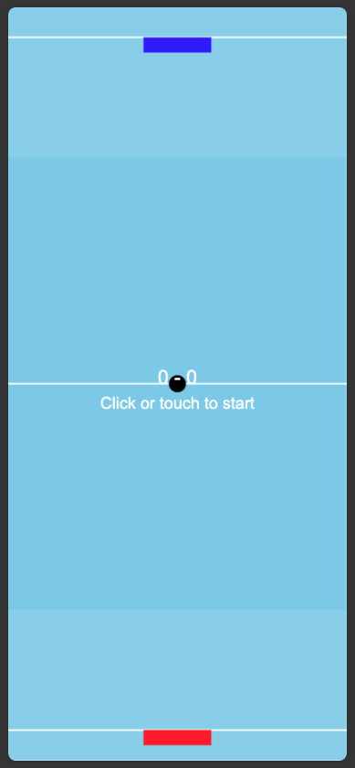

# airhockey-js
HTML5/JS Responsive Air Hockey app with touch screen features (for 2 players) [AI Code Tools test app]

This tool was created by claude 3.5 sonnet with artifacts and projects. The entire prompt trail we used to bootstrap the process is here in (prompt.txt)[./prompt.txt]

How to play

This is a two player game. Each player controls a paddle.

Demo is hosted by github pages
[Demo](https://dolan.github.io/airhockey-js/index.html)

| Platform|Player|Control|Description|
| -- | -- | -- | -- |
| Computer | Left | `Z` | Move paddle Left |
| Computer | Left | `X` | Move paddle Right |
| Computer | Left | ` ` | (Space) Charge paddle |
| Computer | Right| `Left Arrow` | Move paddle Left |
| Computer | Right| `Right Arraow` | Move paddle right |
| Computer | Right| `Up Arrow` | Charge paddle |
| Phone    | Top | Sllide finger | Move paddle left/right |
| Phone    | Both | Move toward Line | Charge paddle |
| Phone    | Bottom | Slide finger | Move paddle left/right |